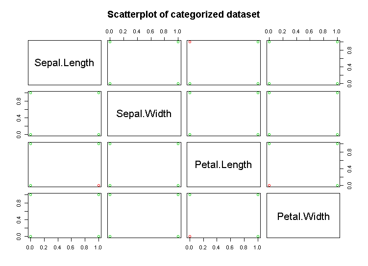

# Gaussian Scatterplot for Study of Categorical Data

I developed this simple plotting technique to explore the relationships between categorical variables 
in a dataset, especially when we have different classes/groups of observations. This idea is simple. 
I just added a noise to all categorical values. For example, a binary value of 0 or 1 became 0.21 or 0.97. 
This was enough to see distribution and concentration of observations from different classes. 
Since I initially used a noise with a normal distribution, I named it the Gaussian Scatterplot :) 

## Example 
The gsp.R file is just an example of this plotting technique. I used the famous iris dataset, 
which includes the measurements of four variables for 50 flowers from three species. Here I 
showed only two classes, versicolor (red dots) and virginica (green dots), identified by different colors. 
first I needed to make the measurements categorical. I simply used the median of measurements, values below the median were
coded as 0 (small) and values above the median were coded as 1 (large). 
As the plots below show, 
the original scatterplot provides almost no information while after adding a little noise 
we can easily recognize the relationships between variables and classes. For example, we can see that 
large petal length and width values is associated with virginica (green dots).

 

 

